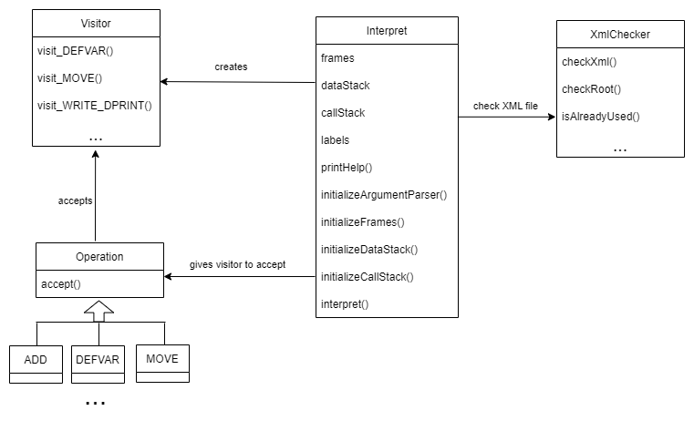

## Implementační dokumentace k 1. úloze do IPP 2022/2023
**Jméno a příjmení**: Veronika Nevařilová  
**Login**: xnevar00


### **1. Struktura skriptu**
Celé řešení je rozděleno do 7 souborů:
- **interpret.py** - hlavní soubor, který spouští celou interpretaci
- **singleton.py** - definice třídy, která implementuje návrhový vzor Singleton.
- **classInterpret.py** - třída `Intepret`, implementovaná jako Jedináček, která se stará o správu toku programu - zpracovává argumenty příkazové řádky, volá kontrolní metody jiných tříd (například na kontrolu XML vstupu), jsou v ní uloženy všechny důležité položky (uchovává rámce, datový zásobník, zásobník volání, slovník návěští), které se dále předávají při intepretaci jednotlivých operací
- **xmlChecker.py** - třída, implementovaná jako Jedináček, pro kontrolu struktury načteného XML souboru (kontrola potřebných atributů, kontrola duplicitního pořadí operace, kontrola správného počtu argumentů vzledem k typu volané operace apod.)
- **operations.py** - třída `Operation`, která obsahuje jedinou metodu `accept`, ze které dědí každá další operace (implementovány také jako třídy)
- **visitor.py** - třída `Visitor` iplementovaná jako Návštěvník tříd operací, kde pro každou operaci obsahuje abstraktní metodu, která se má provést
- **functions.py** - pomocné funkce a položky (konstanty, výčtové typy), které jsou potřeba na více místech při interpretaci a netýkají se jednotlivých operací



### **2. Způsob práce skriptu**

Po spuštění skriptu a kontrole zadaných argumentů příkazové řádky je načtena XML reprezentace kódu pomocí třídy `xml.etree.ElementTree`. Ta je hned zezačátku zkontrolována a `XmlChecker` po úspěšné kontrole vrací seznam načtených intrukcí, které se následně seřadí podle jejich pořadí. Instrukce jsou v seznamu ponechány ve tvaru, v jakém byly načteny třídou `ElementTree`. Dále si interpret vytvoří slovník návěští, aby byl po seznamu při případných skokových instrukcích umožněn jednodušší pohyb. Poté už jen interpret postupně bere instrukce ze seznamu a podle názvu volá v příslušné třídě metodu `accept`. Pro generalizaci kódu se funkce, které jsou u operací často potřeba (kontrola inicializované proměnné, typů, existujícího rámce) se volají funkce ze souboru `functions.py`. Obecně by se ale většina interpretací operací dala popsat následovně:
- načtení argumentů instrukce
- kontrola existence rámce a proměnné, do které se má výsledek uložit
- případná další specifická kontrola operandů podle typu instrukce
- vykonání operace

Jednotlivé rámce jsou ve třídě `Interpret` uloženy ve slovníku rámců `Interpret.frames`, který obsahuje 3 slovníky s klíči `"GF"`, `"TF"` a `"LF"`. Každý rámec obsahuje zase slovníky, kde jejich klíč je název proměnné a ony samotné pak obsahují 2 položky s klíči `"value"` a `"type"`. Pro příklad, celá hierarchie s jednou proměnnou `a` v GF a neexistujícím zbytkem rámců vypadá následovně:
```
Interpret.frames = {"GF" : {"a" : {"value" : 5, "type" = Type.INT}}, 
                    "LF" : UNDEFINEDSTACK, 
                    "TF" : UNDEFINEDSTACK}
```

U operací, které mají podobné požadavky (např. ADD, MUL, SUB, DIV), se při návštěvě instance třídy `Visitor` provede jedna metoda, která je pro tyto operace stejná, a konečný výsledek (například zda se má odčítat nebo přičítat) se posuzuje podle instance samotné operace, za které je metoda volána.

Skokové instrukce byly implementovány pouhou změnou indexu pole na index cílového návěští (získáno ze slovníku návěští `Interpret.labels`), ze kterého jsou čteny instrukce

K volání funkcí operací CALL a navracení z nich je využit zásobník volání. Při operaci CALL je inkrementovaný index v poli instrukcí vložen na zásobník volání a poté je proveden skok na návěští. Naopak při operaci RETURN je z vrcholu zásobníku volání do indexu pole instrukcí uložena předchozí pozice v programu.
